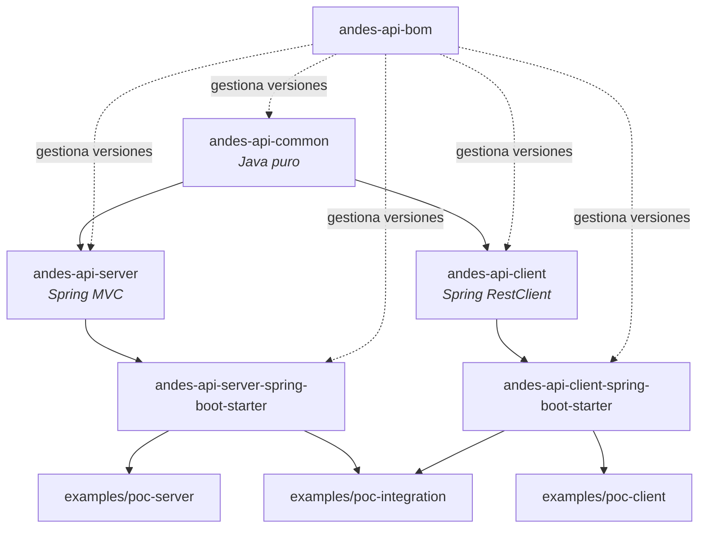

# Andes API Toolkit

Ecosistema de librerías Java para **estandarizar y automatizar la integración de APIs REST basadas en contratos OpenAPI 3**, diseñado para aplicaciones **Spring Boot** modernas.

El objetivo no es un API Gateway ni un framework completo: es un conjunto de librerías reutilizables que resuelven, de forma consistente, **request / response / error handling / configuration / OpenAPI**, tanto para APIs propias expuestas (**Server**) como para APIs externas consumidas (**Client**).

> Proyecto académico — Curso *Java Library Development*. Ver [guia.md](../guia.md) y [rubrica.md](../rubrica.md) en la raíz del workspace para los lineamientos originales.

---

## 1. Stack técnico

| Componente | Versión / Detalle |
|---|---|
| Java | 21 |
| Spring Boot | 4.1.1 |
| Build tool | Maven (multi-módulo) |
| Contrato de API | OpenAPI 3.0.3 |
| Codegen | `openapi-generator-maven-plugin` 7.11.0 (generador `spring`, patrón *delegate*) |
| HTTP Client | Spring `RestClient` (ver [sección 6](#6-por-qué-restclient-y-no-webclient)) |
| Serialización | Jackson (`jackson-databind` + `jackson-datatype-jsr310`) |
| Testing | JUnit 5, Mockito, WireMock, `spring-boot-starter-test` |

---

## 2. Inventario de librerías

| Artefacto | Tipo | Responsabilidad | Depende de |
|---|---|---|---|
| `andes-api-bom` | BOM (pom) | Centraliza versiones de todo el ecosistema | — |
| `andes-api-common` | Librería Java pura | Modelos (`ApiResponse`, `ApiError`, `Pagination`...), jerarquía de excepciones, constantes HTTP, utilidades estáticas | Jackson únicamente (sin Spring) |
| `andes-api-server` | Librería wrapper (Spring MVC) | Correlation id, error handling centralizado, wrapping de respuestas, metadata OpenAPI | `andes-api-common`, `spring-web`, `spring-webmvc` |
| `andes-api-server-spring-boot-starter` | Starter autoconfigurable | Registra automáticamente los beans de `andes-api-server` vía `@AutoConfiguration` | `andes-api-server` |
| `andes-api-client` | Librería wrapper (Spring `RestClient`) | Headers, timeouts, serialización, mapeo de errores HTTP → excepciones | `andes-api-common`, `spring-web` |
| `andes-api-client-spring-boot-starter` | Starter autoconfigurable | Crea automáticamente un `AndesApiClient` por cada cliente configurado en `application.yml` | `andes-api-client` |
| `andes-text-utils` | **Librería clásica** (Java puro) | Slugs, truncado y enmascarado de texto (`SlugUtils`, `MaskUtils`); clases `final`, métodos `static`, cero dependencias | — |
| `andes-id-generator` | **Librería clásica** (Java puro) | Generación de ids ordenables tipo ULID y checksums (`UlidGenerator`, `ChecksumUtils`); clases `final`, métodos `static`, cero dependencias | — |
| `andes-id-generator-spring-boot-starter` | **Librería de envoltura** + autoconfigurable | Envuelve `andes-id-generator` (estático) en un bean `IdGeneratorService` inyectable, registrado vía `@AutoConfiguration` | `andes-id-generator`, `spring-boot-autoconfigure` |
| `examples/poc-server` | PoC | Expone `contracts/openapi-server.yaml` (API-first, patrón delegate) | starter Server |
| `examples/poc-client` | PoC | Consume `openapi-client-a.yaml` e `openapi-client-b.yaml` (modelos generados) | starter Client |
| `examples/poc-integration` | PoC | Expone su propio contrato (`openapi-integration.yaml`) y consume una API externa internamente | starter Server + starter Client |
| `examples/poc-classic-libs` | PoC (Java puro, **sin Spring**) | `main()` de consola que demuestra `andes-text-utils` + `andes-id-generator` | `andes-text-utils`, `andes-id-generator` |
| `examples/poc-wrapper-demo` | PoC (Spring Boot) | Endpoint REST que usa `IdGeneratorService` inyectado por autoconfiguración | starter `andes-id-generator-spring-boot-starter` |

---

## 3. Arquitectura



### Estructura del repositorio

```text
andes-api-toolkit/
├── pom.xml                              # parent reactor + dependencyManagement + pluginManagement
├── andes-api-bom/
├── andes-api-common/
├── andes-api-server/
├── andes-api-client/
├── andes-api-server-spring-boot-starter/
├── andes-api-client-spring-boot-starter/
├── andes-text-utils/                    # librería clásica #1 (Java puro)
├── andes-id-generator/                  # librería clásica #2 (Java puro)
├── andes-id-generator-spring-boot-starter/  # librería de envoltura (wraps andes-id-generator)
├── contracts/                           # fuente de verdad (OpenAPI 3) — ver sección 5
│   ├── openapi-server.yaml
│   ├── openapi-client-a.yaml
│   ├── openapi-client-b.yaml
│   └── openapi-integration.yaml
└── examples/
    ├── poc-server/
    ├── poc-client/
    ├── poc-integration/
    ├── poc-classic-libs/                # PoC sin Spring de las librerías clásicas
    └── poc-wrapper-demo/                # PoC Spring Boot de la librería de envoltura
```

---

## 4. Módulo por módulo

### 4.1 `andes-api-common`

Librería **Java pura** (sin dependencias de Spring). Clases `final`, constructor privado, métodos estáticos donde corresponde (`HeaderUtils`, `ApiResponseUtils`, `ErrorUtils`, `ValidationUtils`, `JsonUtils`, `OpenApiUtils`).

- **Modelos**: `ApiResponse<T>`, `ApiError`, `ApiErrorDetail`, `ApiMetadata`, `ApiRequestMetadata`, `Pagination`, `PageResponse<T>`.
- **Excepciones** (`pe.andes.api.common.exception`):

  ```text
  AndesApiException (abstracta, carga errorCode + httpStatus + details + traceId)
  ├── AndesValidationException        → 422
  ├── AndesAuthenticationException    → 401
  ├── AndesAuthorizationException     → 403
  ├── AndesNotFoundException          → 404
  ├── AndesConflictException          → 409
  ├── AndesBadRequestException        → 400
  └── AndesRemoteServiceException     → 502 (conserva endpoint + status remoto)
  ```

- **HTTP**: `AndesHeaders` (Correlation-Id, Request-Id, Api-Version...), `AndesContentTypes`, `AndesHttpStatus`, `AndesApiConstants` (prefijo de configuración, claves MDC).

### 4.2 `andes-api-server`

Componentes Spring MVC, activados por el starter:

| Clase | Función |
|---|---|
| `CorrelationIdFilter` | Lee/genera `X-Correlation-Id` / `X-Request-Id`, los expone en MDC y los devuelve en la respuesta |
| `GlobalExceptionHandler` | `@RestControllerAdvice` que mapea `AndesApiException` → HTTP status, más `MethodArgumentNotValidException`/`ConstraintViolationException` → 422. Permite registrar `AndesExceptionMapper<E>` para excepciones de terceros |
| `AndesResponseBodyAdvice` | Envuelve automáticamente el `return` del controller en `ApiResponse<T>` (desactivable, ver [sección 5.3](#53-caveat-response-wrapping-vs-envelope-del-contrato)) |
| `AndesOpenApiFactory` | Construye un bean `OpenAPI` (swagger-models) a partir de `AndesServerProperties.OpenApi` (title, contact, license, servers, tags, security schemes) para que `springdoc` lo enriquezca |

Configuración (`andes.api.server.*`):

```yaml
andes:
  api:
    server:
      correlation:
        enabled: true
        generate-if-missing: true
      response:
        wrap-enabled: true          # false en PoCs API-first donde el propio contrato define el envelope
      error-handling:
        enabled: true
        include-stack-trace: false
      openapi:
        enabled: true
        title: Mi API
        version: 1.0.0
        contact: { name: ..., email: ... }
        license: { name: Apache 2.0, url: ... }
        servers: [ { url: http://localhost:8080 } ]
        security-schemes:
          bearerAuth: { type: http, scheme: bearer, bearer-format: JWT }
```

### 4.3 `andes-api-client`

| Clase | Función |
|---|---|
| `AndesApiClient` | Wrapper tipado sobre `RestClient` (`get`, `post`, `put`, `patch`, `delete`) |
| `AndesApiClientRegistry` | Resuelve un `AndesApiClient` por nombre lógico (`registry.get("orders")`) |
| `AndesRestClientFactory` | Construye el `RestClient` por cliente: `baseUrl`, timeouts (`ClientHttpRequestFactorySettings`), interceptor de headers, manejador de errores |
| `AndesClientHeaderInterceptor` | Agrega correlation id / request id / content-type / headers por defecto a cada request saliente |
| `AndesClientErrorMapper` | Mapea status HTTP → excepción común (ver tabla abajo), preservando `code/message/details/traceId` si el body remoto sigue el contrato `ApiError`; si no, arma un mensaje genérico |
| `AndesRestClientCustomizer` | Extension point (`@FunctionalInterface`) para personalizar el `RestClient.Builder` por cliente |

| HTTP Status remoto | Excepción |
|---|---|
| 400 | `AndesBadRequestException` |
| 401 | `AndesAuthenticationException` |
| 403 | `AndesAuthorizationException` |
| 404 | `AndesNotFoundException` |
| 409 | `AndesConflictException` |
| 422 | `AndesValidationException` |
| 5xx / otro | `AndesRemoteServiceException` (conserva `endpoint` + `remoteHttpStatus`) |

Configuración (`andes.api.client.clients.*`):

```yaml
andes:
  api:
    client:
      clients:
        customer:
          base-url: ${CUSTOMER_API_URL}
          connect-timeout: 2s
          read-timeout: 5s
          correlation-id-enabled: true
          request-id-enabled: true
          default-headers:
            X-Api-Key: ${CUSTOMER_API_KEY}
```

Uso en código de negocio:

```java
@Service
class CustomerLookupService {
    private final AndesApiClient customerClient;

    CustomerLookupService(AndesApiClientRegistry registry) {
        this.customerClient = registry.get("customer");
    }

    Customer findById(Long id) {
        return customerClient.get("/customers/" + id, Customer.class);
    }
}
```

### 4.4 Starters (`*-spring-boot-starter`)

Ambos siguen el patrón estándar de Spring Boot 3+/4:

```text
META-INF/spring/org.springframework.boot.autoconfigure.AutoConfiguration.imports
```

- `AndesApiServerAutoConfiguration`: registra `CorrelationIdFilter`, `GlobalExceptionHandler`, `AndesResponseBodyAdvice` y el bean `OpenAPI`, cada uno con `@ConditionalOnMissingBean` + `@ConditionalOnProperty` (el consumidor puede desactivar o reemplazar cualquiera).
- `AndesApiClientAutoConfiguration`: recorre `andes.api.client.clients.*` y crea un `AndesApiClient` por entrada, expuestos vía `AndesApiClientRegistry`.

### 4.5 `andes-api-bom`

Permite a un consumidor externo fijar todas las versiones con un solo `import`:

```xml
<dependencyManagement>
  <dependencies>
    <dependency>
      <groupId>pe.andes.api</groupId>
      <artifactId>andes-api-bom</artifactId>
      <version>1.0.0-SNAPSHOT</version>
      <type>pom</type>
      <scope>import</scope>
    </dependency>
  </dependencies>
</dependencyManagement>
```

### 4.6 Librerías clásicas: `andes-text-utils` y `andes-id-generator`

Dos librerías de **Java puro**, sin ninguna dependencia de Spring ni de ningún framework, pensadas para poder usarse en cualquier tipo de aplicación (Spring, batch, CLI, Jakarta EE, etc.):

- **`andes-text-utils`**: `SlugUtils` (normaliza texto a slugs) y `MaskUtils` (enmascara correos/tarjetas).
- **`andes-id-generator`**: `UlidGenerator` (ids únicos ordenables por tiempo, estilo ULID) y `ChecksumUtils` (CRC32/SHA-256).

Todas las clases son `final`, con constructor privado (lanzan `AssertionError` si se intenta instanciar por reflexión) y **métodos exclusivamente `static`**.

PoC de uso (sin Spring, un simple `main()`):

```bash
cd examples/poc-classic-libs
mvn -q compile exec:java
# o, con el jar ya empaquetado (agregando las dependencias al classpath manualmente):
mvn -q package
java -cp target/classes:../../andes-text-utils/target/classes:../../andes-id-generator/target/classes pe.andes.poc.classiclibs.Main
```

### 4.7 Librería de envoltura: `andes-id-generator-spring-boot-starter`

Envuelve los métodos estáticos de `andes-id-generator` en un bean de Spring (`IdGeneratorService`), registrado automáticamente vía `@AutoConfiguration`, sin modificar ni duplicar la librería clásica original. Este es el patrón típico para integrar código legacy o librerías de métodos estáticos dentro del ecosistema Spring.

```java
@RestController
public class IdGeneratorDemoController {
    private final IdGeneratorService idGeneratorService; // inyectado automáticamente

    public IdGeneratorDemoController(IdGeneratorService idGeneratorService) {
        this.idGeneratorService = idGeneratorService;
    }

    @GetMapping("/api/v1/ids")
    public Map<String, String> generate() {
        return Map.of("id", idGeneratorService.newId());
    }
}
```

PoC de uso (`examples/poc-wrapper-demo`, puerto 8084):

```bash
cd examples/poc-wrapper-demo
mvn -q spring-boot:run &
curl -s http://localhost:8084/api/v1/ids
curl -s "http://localhost:8084/api/v1/ids?prefix=ORD"
curl -s http://localhost:8084/api/v1/ids/hola/checksum
```

---

## 5. Enfoque API-first

Los contratos en [`contracts/`](contracts) son la **fuente de verdad**. El código Java de modelos e interfaces de controller **se genera** en cada build con `openapi-generator-maven-plugin`; nunca se escribe a mano para "parecerse" al contrato.

### 5.1 Server (patrón *delegate*)

Para `poc-server` (contrato `openapi-server.yaml`), el generador produce:

- `pe.andes.poc.server.generated.model.*` — DTOs (`Customer`, `CustomerRequest`, `CustomerEnvelope`, `CustomerPageEnvelope`...).
- `pe.andes.poc.server.generated.api.CustomersApi` / `CustomersApiDelegate` — interfaces con las rutas/verbos ya anotados según el YAML.
- `CustomersApiController` — `@RestController` concreto que implementa `CustomersApi` y delega cada método al bean `CustomersApiDelegate` presente en el contexto.

Lo único escrito a mano es la implementación del delegate:

```java
@Service
public class CustomerApiDelegateImpl implements CustomersApiDelegate {
    // lógica de negocio; el enrutamiento HTTP ya viene generado
}
```

Como el generador y `PocServerApplication` comparten el mismo paquete base (`pe.andes.poc.server`), el component scan de Spring Boot detecta el controller generado sin configuración extra.

`ApiError`, `ApiErrorDetail`, `ApiMetadata` y `Pagination` se mapean vía `importMappings`/`schemaMappings` del plugin a las clases ya existentes en `andes-api-common`, evitando duplicar esos tipos.

### 5.2 Client (solo modelos)

Para `poc-client`, el plugin corre en modo **models-only** (`generateApis=false`) contra `openapi-client-a.yaml` y `openapi-client-b.yaml`, produciendo únicamente los DTOs (`Order`, `OrderItem`, `StockLevel`...) que luego se pasan como `Class<T>` a `AndesApiClient.get/post/...`. Cada aplicación consumidora genera su propia copia de los modelos del contrato compartido — es la práctica estándar de API-first para clientes.

`poc-integration` expone su propio contrato (`openapi-integration.yaml`, patrón delegate, igual que 5.1) **y además** genera su propia copia de los modelos de `openapi-client-a.yaml` para la llamada saliente, mapeando explícitamente entre ambos contratos en `CheckoutService`.

### 5.3 Caveat: response wrapping vs. envelope del contrato

Cuando el contrato ya define la respuesta completa como el envelope estándar (`{success, data, error, metadata}`), dejar activo `AndesResponseBodyAdvice` envolvería el body dos veces. Por eso `poc-server` y `poc-integration` configuran:

```yaml
andes:
  api:
    server:
      response:
        wrap-enabled: false   # el delegate ya arma el envelope completo
```

### 5.4 Comandos de codegen

```bash
# Genera el código a partir de los contratos (target/generated-sources/openapi)
mvn -q generate-sources -pl examples/poc-server,examples/poc-client,examples/poc-integration

# Build completo (incluye generate-sources automáticamente)
mvn -q -DskipTests compile
```

> ⚠️ **Estado de verificación**: esta configuración sigue el comportamiento estándar y documentado del generador `spring` de `openapi-generator`, pero **no ha sido validada con un build real de Maven** en el entorno donde se desarrolló. Antes de confiar en ella para la entrega, ejecuta `mvn -q -DskipTests generate-sources compile` y revisa `target/generated-sources/openapi` de cada módulo.

---

## 6. Por qué `RestClient` y no `WebClient`

Se eligió **Spring `RestClient`** (introducido en Spring Framework 6.1) como implementación principal de `andes-api-client`:

- API síncrona y fluida, más simple que `WebClient` para el caso de uso típico (llamadas request/response bloqueantes).
- No requiere `spring-webflux`/Reactor como dependencia obligatoria.
- Se integra naturalmente con **virtual threads de Java 21**, obteniendo concurrencia eficiente sin el modelo reactivo.
- Es la recomendación actual del equipo de Spring para clientes HTTP síncronos nuevos.

---

## 7. Cómo compilar y ejecutar

### 7.1 Requisitos

- JDK 21
- Maven 3.9+

### 7.2 Build completo

```bash
cd andes-api-toolkit
mvn clean install
```

### 7.3 Ejecutar cada PoC

| PoC | Puerto | Comando | Contrato |
|---|---|---|---|
| `poc-server` | 8080 | `mvn -pl examples/poc-server spring-boot:run` | `contracts/openapi-server.yaml` |
| `poc-client` | 8082 | `mvn -pl examples/poc-client spring-boot:run` | `contracts/openapi-client-a.yaml`, `-b.yaml` |
| `poc-integration` | 8083 | `mvn -pl examples/poc-integration spring-boot:run` | `contracts/openapi-integration.yaml` + `-a.yaml` |

### 7.4 Endpoints de ejemplo

```bash
# poc-server: CRUD de Customers
curl -X POST http://localhost:8080/api/v1/customers \
  -H "Content-Type: application/json" \
  -d '{"fullName":"Ada Lovelace","email":"ada@example.com"}'
curl http://localhost:8080/api/v1/customers/1

# poc-client: consumo de Orders (simulador local incluido)
curl http://localhost:8082/api/v1/orders-demo/ORD-1

# poc-integration: checkout propio -> Client Library -> Orders API (simulada)
curl -X POST http://localhost:8083/api/v1/checkouts \
  -H "Content-Type: application/json" \
  -d '{"customerId":1,"items":[{"sku":"SKU-1","quantity":2,"unitPrice":10.0}]}'
```

Todas las respuestas siguen el envelope estándar:

```json
{
  "success": true,
  "data": { "...": "..." },
  "error": null,
  "metadata": { "traceId": "...", "correlationId": "...", "requestId": "..." }
}
```

---

## 8. Contratos OpenAPI

| Archivo | Rol | Notas |
|---|---|---|
| `openapi-server.yaml` | API propia expuesta (Customers) | Respuestas ya incluyen el envelope Andes |
| `openapi-client-a.yaml` | API externa (Orders) | Envelope propio del partner, distinto al de Andes — demuestra adaptación a contratos ajenos |
| `openapi-client-b.yaml` | API externa (Inventory) | Paginación por cursor, estructura heterogénea respecto a Client A |
| `openapi-integration.yaml` | API propia del PoC de integración (Checkout) | Reutiliza `ApiError`/`ApiMetadata` de `andes-api-common` vía `importMappings` |

---

## 9. Versionamiento

Se aplica **Semantic Versioning** (`MAJOR.MINOR.PATCH`), comenzando en `1.0.0`:

- **MAJOR**: cambios incompatibles en la API pública de cualquier módulo (firma de métodos, propiedades renombradas/eliminadas, contratos OpenAPI con breaking changes).
- **MINOR**: nuevas funcionalidades retrocompatibles (nuevas propiedades opcionales, nuevos endpoints, nuevas excepciones).
- **PATCH**: correcciones de bugs sin cambios de API.

El `andes-api-bom` siempre fija la misma versión para todos los artefactos del ecosistema.

---

## 10. Testing

| Módulo | Tipo de test | Herramientas |
|---|---|---|
| `andes-api-common` | Unitarios (modelos, excepciones, utilidades) | JUnit 5 |
| `andes-api-server` | Unitarios (`GlobalExceptionHandler`, `AndesOpenApiFactory`) | JUnit 5, Mockito |
| `andes-api-server-spring-boot-starter` | Integración de autoconfiguración (`ApplicationContextRunner`) | `spring-boot-test-autoconfigure` |
| `andes-api-client` | Unitarios + integración HTTP simulada | JUnit 5, WireMock |
| `andes-api-client-spring-boot-starter` | Integración de autoconfiguración | `spring-boot-test-autoconfigure` |
| `andes-text-utils` / `andes-id-generator` | Unitarios (Java puro) | JUnit 5 |
| `andes-id-generator-spring-boot-starter` | Integración de autoconfiguración | `spring-boot-test-autoconfigure`, AssertJ |
| `examples/*` | Integración end-to-end (`@SpringBootTest`) | `RestTestClient` |

```bash
mvn test                 # todos los módulos
mvn -pl andes-api-client test   # un módulo puntual
```

---

## 11. Publicación

El proyecto tiene configurado `<distributionManagement>` (pom raíz y `andes-api-bom`) con dos repositorios: `nexus-releases` y `nexus-snapshots`. Por defecto apuntan a un repositorio **local basado en archivo** (`.local-nexus-repo/`, ignorado por git) para poder ejecutar `mvn deploy` de punta a punta sin depender de un servidor real — **esto ya fue probado y verificado** (los 15 módulos se publicaron correctamente, ver `.local-nexus-repo/snapshots/pe/andes/api/...`).

Scripts disponibles en `scripts/` (Linux/Mac `.sh` y Windows `.ps1` para cada uno):

| Script | Qué hace |
|---|---|
| `publish-local.sh` / `.ps1` | `mvn clean install` → publica en Maven Local (`~/.m2`) |
| `publish-nexus.sh` / `.ps1` | `mvn clean deploy` → publica en el repo configurado en `distributionManagement` (local de prueba por defecto, o un Nexus/Artifactory real pasando las URLs como argumento) |
| `publish-jitpack.sh` / `.ps1` | Crea y empuja un tag `vX.Y.Z` (a partir de la versión del pom, sin `-SNAPSHOT`); JitPack construye el artefacto bajo demanda a partir de ese tag, sin necesitar configuración adicional del lado del proyecto |

```bash
# Maven Local
./scripts/publish-local.sh

# Nexus/Artifactory: modo local de prueba (sin argumentos)
./scripts/publish-nexus.sh

# Nexus/Artifactory real (requiere credenciales en ~/.m2/settings.xml, serverId nexus-releases/nexus-snapshots)
./scripts/publish-nexus.sh https://nexus.miempresa.com/repository/maven-releases/ \
                           https://nexus.miempresa.com/repository/maven-snapshots/

# JitPack
./scripts/publish-jitpack.sh
```

En Windows (PowerShell): `.\scripts\publish-local.ps1`, `.\scripts\publish-nexus.ps1`, `.\scripts\publish-jitpack.ps1` (mismos parámetros, sintaxis `-Nombre valor`).

---

## 12. Limitaciones conocidas / próximos pasos

- Faltan los documentos individuales sugeridos por la guía del curso (`ARCHITECTURE.md`, `GETTING_STARTED.md`, `SERVER.md`, `CLIENT.md`, `ERROR_HANDLING.md`, `CONFIGURATION.md`, `OPENAPI.md`, `VERSIONING.md`, `PUBLISHING.md`) — este README los consolida en un único documento por ahora.
- No hay Spring REST Docs configurado (solo Javadoc + OpenAPI/Swagger UI autogenerado en `poc-server`/`poc-integration`).
- La publicación a Nexus/JitPack fue verificada con `mvn deploy` real contra un repositorio de prueba local; publicar contra un Nexus corporativo o Maven Central real requiere credenciales que no se han configurado en este entorno académico.
- Falta la presentación (ppt/diagramas) para la sustentación.

---

## 13. Licencia

Apache License, Version 2.0 — ver [LICENSE](https://www.apache.org/licenses/LICENSE-2.0.txt).
